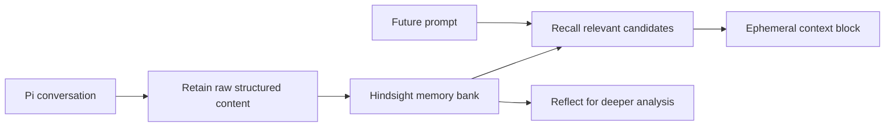

# Pi Hindsight Extension

Persistent memory for [Pi](https://github.com/mariozechner/pi) backed by [Hindsight](https://hindsight.vectorize.io/).

Pi Hindsight recalls relevant project memory before model calls, retains structured session deltas after completed agent runs, and exposes explicit memory tools for direct retain/recall/reflect operations.

The extension is heavily inspired by [`noctuid/pi-hindsight`](https://github.com/noctuid/pi-hindsight). This version keeps the same useful idea, then tightens project isolation, queue durability, diagnostics, and release hardening.

## Compatibility

Supported runtime and package ranges are declared in `package.json` and enforced in CI with `npm ci --engine-strict`.

- Node.js: `>=24 <25`
- npm: `>=11 <12`
- Pi peer package: `@mariozechner/pi-coding-agent >=0.72.1 <0.73.0`
- TypeBox peer package: `typebox >=1.1.24 <2`

## Mental model

Hindsight separates storage, retrieval, and reasoning:

```text
Retain  = store raw contextual memory
Recall  = retrieve relevant memory candidates
Reflect = analyze memory for patterns or answers
```

Everything lives in a **memory bank**. This extension defaults to a project bank per repo so unrelated projects do not leak into each other. A user bank is optional and explicit.



Sharp rules:

- Retain raw rich content, not summaries.
- Use stable document IDs for live sessions.
- Keep recall ephemeral; do not write recalled memory back into transcripts.
- Use tags and banks for scope.
- Keep user memory opt-in and intentional.

See [`docs/hindsight-core-functions.md`](docs/hindsight-core-functions.md) and [`docs/memory-behavior.md`](docs/memory-behavior.md) for details.

## Current status

This is a working MVP and still pre-release. The core memory path is implemented and the first hardening roadmap is complete.

Implemented:

- automatic recall through Pi's `context` hook
- automatic retain through Pi's `agent_end` hook
- queue-first retain with lock, retry, malformed-line quarantine, and dead-letter handling
- stable live-session document IDs
- project/user memory profiles
- historical Pi session import with manifest and checkpoint support
- setup/status TUI through `/hindsight`
- explicit tools and command shortcuts for advanced use
- CI on Ubuntu, macOS, and Windows
- release verification, trusted publishing, dependency review, audit signatures, and live Hindsight smoke tests

Intentionally deferred:

- persisted recall messages in Pi transcript history
- cached recall context
- hashtag controls such as `#nomem`
- generic memory-backend abstraction
- automatic mental-model management
- broad bank administration UI beyond setup/config guidance

See [`docs/risky-memory-modes.md`](docs/risky-memory-modes.md) for why these remain deferred. Pi Hindsight stays Pi-first; framework adapters such as LiteLLM, CrewAI, Pydantic AI, OpenAI Agents, and Vercel AI SDK belong in companion packages or examples. See [`docs/core-vs-companion-adapters.md`](docs/core-vs-companion-adapters.md).

## Install

Install from GitHub:

```bash
pi install https://github.com/luxus/pi-hindsight
```

For local development, install a checkout path instead:

```bash
pi install /path/to/pi-hindsight
```

Package name: `@luxusai/pi-hindsight`.

## Quick start

1. Start or choose a Hindsight server:
   - [Hindsight Cloud signup](https://ui.hindsight.vectorize.io/signup)
   - [Local Hindsight installation](https://hindsight.vectorize.io/developer/installation)

2. Open Pi in your repo and run:

   ```text
   /hindsight
   ```

3. Configure the Hindsight API URL. The default local URL is:

   ```text
   http://localhost:8888
   ```

4. Choose a memory profile:
   - `project-only`: safest default; repo memory stays in a project bank.
   - `project+global`: recalls project memory plus durable user preferences.
   - `global-only`: user-only shared memory; automatic project retain is disabled.

5. Start coding. Recall happens before provider calls; retain happens after completed agent runs.

For a minimal project-local config:

```json
{
  "hindsight": {
    "baseUrl": "http://localhost:8888"
  }
}
```

For a stable human-chosen project bank:

```json
{
  "hindsight": {
    "baseUrl": "http://localhost:8888"
  },
  "banks": {
    "project": {
      "derive": "manual",
      "bankId": "pi-project-my-repo"
    }
  }
}
```

See [`docs/configuration.md`](docs/configuration.md) for config precedence, environment variables, advanced fields, and examples.

## Common commands

`/hindsight` is the main control center.

Useful shortcuts:

```text
/hindsight:init                         # write a minimal project config
/hindsight:import-current --dry-run     # preview current session import
/hindsight:import-project-sessions      # import repo-scoped Pi sessions
/hindsight:flush                        # flush queued retain jobs
/hindsight:last-recall                  # inspect opt-in last recall snapshot
/hindsight:mode read-only               # recall only; no automatic retain
/hindsight:next-opt-out                 # skip automatic retain once
```

See [`docs/tools-and-commands.md`](docs/tools-and-commands.md) for the full command and tool surface. Generated tools, commands, and config fields are listed in [`docs/surface-reference.md`](docs/surface-reference.md).

## Historical import

Historical import can import the current Pi session, an explicit JSONL path, or repo-scoped sessions from the active session directory. Imports use deterministic document IDs and maintain checkpoint/manifest files under `.pi/hindsight/`.

Preview before writing:

```text
/hindsight:import-current --dry-run
/hindsight:import-project-sessions --dry-run
```

Project session discovery scans only the current session directory and keeps `.jsonl` sessions whose parsed `cwd` normalizes to the current repo/cwd. Equivalent paths such as trailing separators, `.` segments, `..` traversal back to the repo, and resolved absolute paths are treated as the same project.

See [`docs/importing-sessions.md`](docs/importing-sessions.md) for import options, checkpoint behavior, and rebuild guidance.

## Configuration files

Config is resolved from:

1. `~/.pi/agent/hindsight.json` or `.jsonc`
2. `.pi/hindsight.json` or `.jsonc` in the current repo
3. environment variables

If both `.json` and `.jsonc` exist at the same scope, `.json` wins. Environment variables win over files.

Common environment variables:

```bash
export HINDSIGHT_BASE_URL=http://localhost:8888
export HINDSIGHT_API_KEY=...
export PI_HINDSIGHT_PROJECT_BANK_ID=pi-project-my-repo
export PI_HINDSIGHT_USER_BANK_ID=user-luxus
```

## Safety

The extension redacts common API keys, bearer tokens, GitHub tokens, password-style environment assignments, and credentials embedded in URLs before automatic retain.

Debug sidecars such as last-recall snapshots are opt-in and local. They may contain memory text and query excerpts, so enable them only when local disk visibility is acceptable.

Exact document deletion is available through `hindsight_delete_document`, requiring exact bank, exact document ID, and `confirm: true`.

## Development

Install dependencies and run checks:

```bash
npm install
npm run check
npm run check:coverage
npm run typecheck:tsc
```

Run Pi with the local extension:

```bash
pi -e ./extensions/index.ts
```

Before release-path changes, also run:

```bash
npm run audit:signatures
npm run pack:verify
```

For memory-path behavior changes, prove the live path with local smoke or a configured `Hindsight Integration` workflow pass:

```bash
export HINDSIGHT_BASE_URL=http://localhost:8888
npm run smoke:hindsight
```

See [`docs/development.md`](docs/development.md) and [`docs/release.md`](docs/release.md) for maintainer details.

## Documentation map

- [`docs/getting-started.md`](docs/getting-started.md) — first setup and profiles
- [`docs/configuration.md`](docs/configuration.md) — config files, env vars, examples
- [`docs/memory-behavior.md`](docs/memory-behavior.md) — recall, retain, queue, scope, safety
- [`docs/importing-sessions.md`](docs/importing-sessions.md) — historical import
- [`docs/tools-and-commands.md`](docs/tools-and-commands.md) — explicit tools and command shortcuts
- [`docs/development.md`](docs/development.md) — local development and checks
- [`docs/release.md`](docs/release.md) — release and smoke verification
- [`docs/architecture-todos.md`](docs/architecture-todos.md) — architecture notes and deferred deepening
- [`docs/post-mvp-roadmap.md`](docs/post-mvp-roadmap.md) — completed follow-up hardening and deferred ideas
