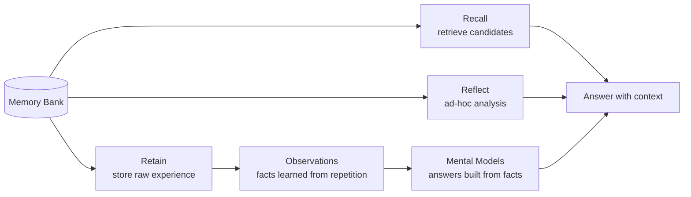
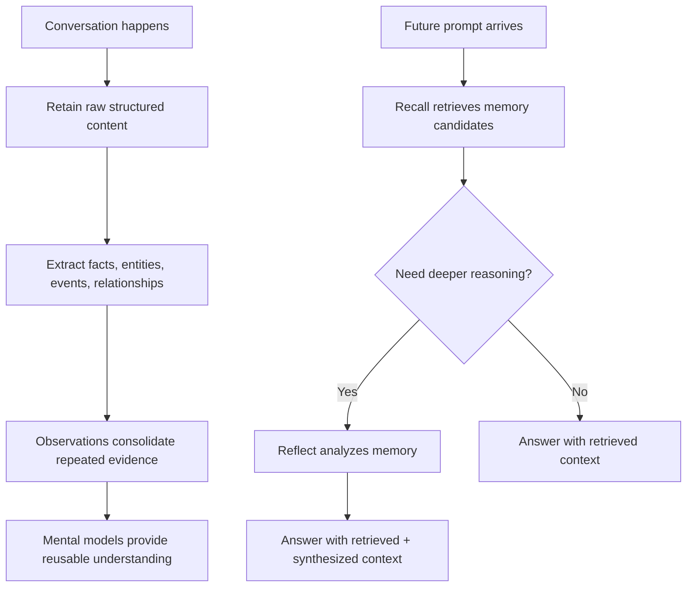

# Pi Hindsight Extension

Persistent memory for Pi, backed by [Hindsight](https://hindsight.vectorize.io/).

This package adds a Pi extension that can recall relevant project memory before model calls, retain structured session deltas after completed agent runs, and expose explicit tools for direct memory operations.

The extension is heavily inspired by [`noctuid/pi-hindsight`](https://github.com/noctuid/pi-hindsight). Many product ideas, memory lifecycle choices, and Pi/Hindsight integration patterns started from that extension and were adapted here with stricter project isolation, queue durability, diagnostics, and release-hardening goals.

## Compatibility

Supported runtime and package ranges are declared in `package.json` and enforced in CI with `npm ci --engine-strict`.

- Node.js: `>=24 <25`
- npm: `>=11 <12`
- Pi peer package: `@mariozechner/pi-coding-agent >=0.72.1 <0.73.0`
- TypeBox peer package: `typebox >=1.1.24 <2`

Development dependencies pin the tested Pi package and native TypeScript preview build so local checks and CI resolve the same compatibility baseline.

## Hindsight mental model

**[Hindsight](https://hindsight.vectorize.io/) is a memory system that separates storage, retrieval, and reasoning.**

```text
Retain  = store memory
Recall  = retrieve memory candidates
Reflect = analyze memory
```

Everything happens inside a **memory bank**, an isolated namespace that decides which memories belong together. Banks prevent leakage, simplify governance, and make memory easier to inspect.



Core functions:

| Function      | Role                                 | Sharp rule                                     |
| ------------- | ------------------------------------ | ---------------------------------------------- |
| Memory Bank   | isolated memory namespace            | keeps unrelated memory apart                   |
| Retain        | store raw contextual source material | store raw data so the system can extract truth |
| Recall        | retrieve relevant memory candidates  | recall returns candidates, not answers         |
| Reflect       | ad-hoc agentic analysis over memory  | use for one-off why/how/pattern questions      |
| Observations  | auto-generated beliefs from evidence | facts learned from repetition                  |
| Mental Models | reusable stable syntheses            | answers built from remembered facts            |



Do:

- store raw, contextual data
- use consistent `document_id`s
- set useful `context`
- tag aggressively
- separate unrelated memory into banks
- use recall before answer generation
- use reflect for deeper ad-hoc analysis
- use mental models for recurring stable context

Don't:

- summarize before retain when raw data exists
- use random document IDs for the same source
- mix unrelated projects in one memory bank
- store recalled memory back into memory
- use metadata as the main filter
- rely on recall alone for complex analysis
- treat observations and mental models as the same thing

Common failure modes:

| Failure          | Result                                          | Fix                                                                       |
| ---------------- | ----------------------------------------------- | ------------------------------------------------------------------------- |
| Bad retain       | missing context → weak extraction → weak recall | retain raw structured data, add clear `context`, use stable `document_id` |
| No tags          | wrong memories retrieved                        | tag by project, user, source; use strict filtering when scope matters     |
| No reflect       | shallow answers for complex questions           | use recall for candidates and reflect for analysis                        |
| Too many banks   | fragmented knowledge                            | separate only meaningful scopes; use tags inside banks when enough        |
| Too much summary | lost evidence                                   | retain raw source when possible                                           |

See [`docs/hindsight-core-functions.md`](docs/hindsight-core-functions.md) for fuller infographic copy and a prompt you can give ChatGPT to generate a visual explainer.

## Current status

This is a working MVP and still pre-release. The core memory path is implemented; the first hardening roadmap is complete. See [`docs/pr-roadmap.md`](docs/pr-roadmap.md) for the completed MVP hardening plan and [`docs/post-mvp-roadmap.md`](docs/post-mvp-roadmap.md) for the next roadmap.

Implemented:

- Pi package metadata in `package.json`
- extension entrypoint at `extensions/index.ts`
- config resolution from defaults, global config, project config, and environment
- deterministic project bank derivation
- stable live-session document IDs
- Hindsight client adapter using `@vectorize-io/hindsight-client`
- automatic recall through Pi's `context` hook
- automatic retain queueing through Pi's `agent_end` hook
- best-effort queue flushing on `session_shutdown`
- import manifest tracking for historical session imports
- explicit tools:
  - `hindsight_recall`
  - `hindsight_retain`
  - `hindsight_configure`
  - `hindsight_import`
  - `hindsight_reflect`
- commands:
  - `/hindsight`
  - `/hindsight:init`
  - `/hindsight:import`
  - `/hindsight:import-current`
  - `/hindsight:import-file`
  - `/hindsight:import-project-sessions`
  - `/hindsight:flush`
  - `/hindsight:last-recall`
  - `/hindsight:session`
  - `/hindsight:mode`
  - `/hindsight:retain`
  - `/hindsight:next-opt-out`
  - `/hindsight:tag`
- tests for config, bank derivation, stable document IDs, sanitization, recall formatting, retain payloads, diagnostics, client request shapes, extension hook placement, historical import, import manifests, and queue replay

Recently completed release-hardening work:

- roadmap/docs now match the implementation that already exists
- focused Hindsight best-practice regression tests cover core memory invariants
- documented configuration starts with memory profiles and minimal project config
- outage, dead-letter, queue-lock, and append capability behavior is documented and tested
- bank mission and observation-scope defaults are tuned for memory quality
- historical import previews show document counts, update modes, checkpoint paths, and manifest behavior
- packaging and live smoke-test paths are verified for release readiness

Intentionally deferred:

- persisted recall messages in Pi transcript history
- linked hosts or multi-Hindsight-server routing
- cached recall context
- hashtag-based controls such as `#nomem`
- generic memory-backend abstractions
- automatic mental-model management
- bank administration UI beyond setup guidance
- OpenClaw-style multitenant dynamic routing

See [`docs/risky-memory-modes.md`](docs/risky-memory-modes.md) for why persisted recall transcript messages, provider recall caching, and prompt hashtag controls remain deferred, and why command-based controls such as `/hindsight:next-opt-out` are preferred.

See [`docs/next-opt-out-design.md`](docs/next-opt-out-design.md) for the implemented one-turn memory opt-out command design.

Historical import supports importing the current Pi session, an explicit JSONL path, or all Pi session JSONL files in the current session directory that belong to the current repo/cwd. Imports write deterministic document IDs and update an import manifest that is summarized in `/hindsight`. Use `/hindsight:import --dry-run`, `/hindsight:import-project-sessions --dry-run`, or `hindsight_import` with `dryRun: true` to preview documents, message counts, content sizes, tags, update mode, and target bank without writing Hindsight memory or mutating the manifest. Add `--all-leaves` or `allLeaves: true` to preview/import every branch leaf instead of only the current branch. Project session discovery intentionally avoids broad history imports: it scans only the current session file's directory and keeps only `.jsonl` session files whose parsed `cwd` exactly matches the current repo/cwd. Imports maintain `.pi/hindsight/import-checkpoint.json` by default and resume completed documents without re-retaining them when `import.resume` is enabled.

Historical import examples:

```text
# Preview the current session; writes nothing and leaves the manifest unchanged.
/hindsight:import-current --dry-run

# Import the current session's current branch only, using deterministic replace documents.
/hindsight:import-current

# Preview every fork leaf in an explicit session file.
/hindsight:import-file /path/to/session.jsonl --dry-run --all-leaves

# Preview all sessions in the active session directory whose parsed cwd equals this repo.
/hindsight:import-project-sessions --dry-run

# Import those repo-scoped sessions after reviewing the preview.
/hindsight:import-project-sessions
```

Preview output includes message count, document count, update mode, status, checkpoint path, and the unchanged manifest path. Import output reports the same document summary plus the first document ID and manifest path. Use `--all-leaves` only when you explicitly want every fork leaf; the default imports only the current branch.

## Install

Install the current pre-release directly from GitHub:

```bash
pi install https://github.com/luxus/pi-hindsight
```

An npm package install path is planned later. Until then, use the GitHub URL above or a local checkout path.

## Install for local development

```bash
npm install
npm run typecheck
npm test
```

Run Pi with the local package or extension:

```bash
pi -e ./extensions/index.ts
```

For local development, install a checkout path instead:

```bash
pi install /path/to/pi-hindsight
```

Planned npm package name: `@luxus/pi-hindsight`.

## Configuration

Defaults can be overridden by:

1. `~/.pi/agent/hindsight.json` or `~/.pi/agent/hindsight.jsonc`
2. `.pi/hindsight.json` or `.pi/hindsight.jsonc` in the current repo
3. environment variables

If both `.json` and `.jsonc` exist at the same scope, `.json` wins. Config is normalized after merging. Unknown fields are ignored, and invalid values fall back to defaults.

### Minimal configuration path

Start with the smallest project-local config that points Pi at your Hindsight server. The default memory profile is `project-only`, which keeps automatic recall and retain scoped to a project bank.

Use one of these Hindsight deployment paths:

- [Hindsight Cloud signup](https://ui.hindsight.vectorize.io/signup)
- [Local Hindsight installation](https://hindsight.vectorize.io/developer/installation)

After you have a Hindsight server URL, put it in project config:

```json
{
  "hindsight": {
    "baseUrl": "http://localhost:8888"
  }
}
```

If you want a stable human-chosen project bank instead of the derived repo bank, add only the bank ID:

```json
{
  "hindsight": {
    "baseUrl": "http://localhost:8888"
  },
  "banks": {
    "project": {
      "derive": "manual",
      "bankId": "pi-project-my-repo"
    }
  }
}
```

Most users should choose one memory scope profile and leave the advanced fields alone:

- `project-only` is the safest default. Project memories stay in the project bank, and automatic retain writes there.
- `project+global` is useful for personal coding. Project facts stay project-scoped, while durable preferences and cross-project habits can also be recalled from a global bank.
- `global-only` is intentionally broad. It disables the project bank and automatic retain because there is no project-scoped write route.

Use `/hindsight` for guided configuration and memory status, or `/hindsight:init` for a quick project config with the currently selected project bank.

Inside Pi, open the interactive configuration TUI:

```text
/hindsight
```

The setup TUI opens with a Status tab for memory health, then offers focused edit tabs for connection, banks, recall, retain, import, and UI settings. Use `h`/`l` or `<`/`>` to switch tabs, `j`/`k` to move between settings, `Enter` to open the selected setting, `r` to remove the selected setting's active override, and `d` for deployment setup. Setting rows show the effective value plus its source (`project`, `global`, `env`, or `default`). Setting descriptions, default values, and all layers are shown inside the edit modal. Settings that support both scopes can be saved to project config (`.pi/hindsight.json`) or global config (`~/.pi/agent/hindsight.json`) from that modal. Project-specific settings such as project bank ID and memory profile are fixed to project scope. Environment overrides win the effective value, but project/global stored values can still be edited for future runs after the environment override is removed. Changes are saved immediately and the extension config is reloaded after each change. Deployment choices cover Hindsight Cloud, an existing local/external API, and local `hindsight-embed` guidance. The local `hindsight-embed` profile gives commands to run yourself and can set the base URL to `http://localhost:8888`; it does not manage daemons.

Memory profiles make global memory explicit. Choose the narrowest route that fits the repo:

- `project-only` keeps recall and automatic retain scoped to the selected project bank. Use this for sensitive repos, work projects, client code, or any repository where deletion/export/debugging should stay isolated.
- `project+global` recalls from both the project bank and a configured global bank. Use this for most personal coding: project facts remain in the project bank, while durable preferences and cross-project habits can be recalled from the global bank. Automatic retain still writes project transcript deltas to the project bank by default.
- `global-only` disables the project bank and recalls only from the global bank. Use this only when broad shared global recall is acceptable and you intentionally run a one-bank workflow. Automatic retain is disabled because there is no project bank retain route; use `hindsight_retain` with the global bank ID when you intentionally want global memory.

When a profile enables global memory without an existing bank ID, setup writes `pi-global` as the global bank ID. Override it with `PI_HINDSIGHT_GLOBAL_BANK_ID`, `.pi/hindsight.json` `banks.global.bankId`, or the setup TUI if you prefer a different shared bank. `banks.global.bankId` is used only when `banks.global.enabled` is `true`.

Profile routing is inspectable in `/hindsight`, which shows memory health, active profile, project/global banks, queue path, and import status.

For a quick default config, run:

```text
/hindsight:init
```

That writes `.pi/hindsight.json` with the currently selected project bank ID and current Hindsight base URL. Agents can also call the `hindsight_configure` tool to write a specific project bank override.

Supported environment overrides:

```bash
export HINDSIGHT_BASE_URL=http://localhost:8888
export HINDSIGHT_API_KEY=...
# or point config/env at another env var without storing the raw key:
export HINDSIGHT_API_KEY_REF=HINDSIGHT_API_KEY
# project config SecretRef shape:
# { "hindsight": { "apiKey": { "source": "env", "name": "HINDSIGHT_API_KEY" } } }
export PI_HINDSIGHT_ENABLED=true
export PI_HINDSIGHT_PROJECT_BANK_ID=pi-project-my-repo
export PI_HINDSIGHT_GLOBAL_BANK_ID=pi-global
```

Advanced project config example:

```json
{
  "banks": {
    "project": {
      "bankId": "pi-project-my-repo",
      "derive": "manual",
      "retainMission": "Extract architecture decisions, bugs, fixes, constraints, durable preferences, and project continuity. Ignore chatter, secrets, and repeated recalled memory.",
      "reflectMission": "Help a Pi coding agent use project memory for current architecture, decisions, constraints, bugs, fixes, and continuity.",
      "observationsMission": "Identify durable project patterns, recurring constraints, and contradictions across Pi coding sessions."
    },
    "global": {
      "enabled": false,
      "bankId": "pi-global",
      "retainMission": "Extract durable cross-project user preferences, recurring workflows, coding habits, and stable assistant behavior.",
      "reflectMission": "Help recall durable cross-project user preferences, recurring workflows, coding habits, and stable assistant behavior.",
      "observationsMission": "Identify durable cross-project user preferences, recurring workflows, coding habits, and stable assistant behavior patterns."
    }
  },
  "recall": {
    "budget": "mid",
    "maxTokens": 800,
    "types": ["observation"],
    "roles": ["user", "assistant"],
    "contextTurns": 2,
    "maxQueryChars": 800,
    "queryPreamble": "Pi coding task memory lookup.",
    "projectQueryPreamble": "Project memory lookup for current repo architecture, tasks, bugs, decisions, and constraints.",
    "globalQueryPreamble": "Global memory lookup for durable user preferences, recurring workflows, coding habits, and cross-project context.",
    "includeDateInQuery": false,
    "includeRepoHintsInQuery": true,
    "queryTimestamp": "2024-05-01T00:00:00Z",
    "storeLastRecall": false,
    "storeLastRecallFailures": false,
    "lastRecallPath": ".pi/hindsight/last-recall.json",
    "topK": 8,
    "timeoutMs": 10000,
    "injectionPosition": "append"
  },
  "observations": {
    "enabled": true,
    "scopes": [["harness:pi"], ["repo:{repoKey}"]]
  },
  "retain": {
    "queuePath": ".pi/hindsight/retain-queue.jsonl",
    "flushIntervalMs": 30000,
    "periodicFlushMaxJobs": 1,
    "periodicFlushTimeoutMs": 2000,
    "updateMode": "append",
    "entities": [{ "text": "Pi", "type": "project" }],
    "content": {
      "user": ["text"],
      "assistant": ["text", "toolCall"],
      "toolResult": ["error"]
    },
    "toolFilter": {
      "toolCall": { "exclude": ["hindsight_retain", "hindsight_recall", "hindsight_reflect"] },
      "toolResult": {
        "exclude": [
          "hindsight_retain",
          "hindsight_recall",
          "hindsight_reflect",
          "read",
          "grep",
          "find",
          "find_files",
          "ls"
        ]
      }
    },
    "strip": {
      "message": ["usage", "cost", "responseId"],
      "topLevel": ["id", "parentId"]
    },
    "shutdownFlushMaxJobs": 10,
    "shutdownFlushTimeoutMs": 2000
  },
  "import": {
    "manifestPath": ".pi/hindsight/import-manifest.json"
  },
  "status": {
    "style": "text",
    "detail": "activity",
    "maxLength": 24,
    "showActivity": true
  },
  "notifications": {
    "startup": true,
    "recall": false,
    "retain": false
  }
}
```

## Memory behavior

Automatic recall runs in the `context` hook and injects an ephemeral `<hindsight-memory>` message into the provider context. Set `recall.storeLastRecall: true` to write a local visibility snapshot for `/hindsight:last-recall`; add `recall.storeLastRecallFailures: true` to include failed recall attempts, redacted error messages, queries, banks, and scope tags when all recalls fail. These debug sidecars are also available in the setup TUI's advanced Recall fields. Project bank recall is scoped by the current repo tag. If a global bank is enabled, global recall uses an explicit non-repo `source:pi` scope so cross-project memories can be found without requiring the current repo tag. The `project+global` profile queries both banks and labels recalled blocks by source; `global-only` queries only the global bank. Recall defaults to `recall.types: ["observation"]` because observations are Hindsight's consolidated, deduplicated memory layer; set `recall.types` to include `world` or `experience`, or to an empty list, only when you explicitly want lower-level raw memory types. Set `recall.queryTimestamp` only when recall should be anchored to a specific point in time; otherwise omit it so Hindsight uses the current request time. Recall query composition is deterministic and bank-aware: selected messages are role-labeled, bounded by `recall.roles`, `recall.contextTurns`, and `recall.maxQueryChars`, and can include `recall.projectQueryPreamble` / `recall.globalQueryPreamble`, optional `recall.includeDateInQuery`, and repo hints controlled by `recall.includeRepoHintsInQuery`. Slow recalls are bounded by `recall.timeoutMs`. `recall.topK` limits injected results per bank. Recall visibility is sidecar-only and opt-in: set `recall.storeLastRecall: true` to write the latest recall snapshot to `recall.lastRecallPath`, then inspect it with `/hindsight:last-recall` or `/hindsight:last-recall --json`. The default snapshot path is ignored by this repository; custom paths should be added to your own ignore rules. Snapshots contain recalled memory and query excerpts, so enable this only when local disk visibility is acceptable. Snapshots are not inserted into provider context or automatic retain by this extension. `/hindsight:recall-cleanup` scans the current Pi session transcript for accidentally persisted `<hindsight-memory>` blocks and reports matching line numbers. Pruning requires an explicit offline file path: `/hindsight:recall-cleanup <session.jsonl> --prune` removes matching injected-memory JSONL lines after writing a unique `.hindsight-recall-prune.*.bak` backup next to the session file. The default recall budget is `mid`, and the default injection position is `append`: recall is inserted near the end of provider context, before the current user message when present, so fresh memory does not change the beginning of the provider prompt and break prompt caching. `prepend` remains configurable for users who explicitly prefer memory before the transcript, but it can reduce prompt-cache hits because every recalled block changes the prompt prefix. The injected memory block is not written to the Pi transcript by this extension.

Automatic retain runs in the `agent_end` hook. It stores a structured JSON projection of new messages, not a summary. The retain projection is controlled by `retain.content`, `retain.toolFilter`, and `retain.strip`; defaults keep user/assistant text, assistant tool calls, tool result errors, and per-message timestamps while excluding recursive Hindsight tool output and noisy read/search results. Live sessions use stable `documentId` values and `updateMode: "append"`. When retain is enabled and either project auto-retain or a configured global-only explicit retain route is available, startup probes append support with a deterministic `pi-hindsight-capability:append:<bank>` document tagged `test:capability` and `feature:append-probe`. If append is known unsupported, retain fails clearly because append support is required for live sessions. A persisted retain cursor under `.pi/hindsight/retain-cursors.json` prevents duplicate appends when Pi provides overlapping transcripts, including after extension restart. Explicit retain tool tags are merged with the base `source:pi`, repo, and session tags so manually retained memories remain visible to default project recall. Configure `retain.entities` to attach known entity hints to automatic retain jobs, or pass `entities` to the explicit `hindsight_retain` tool for one-off memories. Per-session governance is stored outside provider-visible messages under `.pi/hindsight/session-meta/`. `/hindsight:mode normal|read-only|ignored` controls whether a session recalls and/or retains memory, `/hindsight:retain on|off` toggles retain for the session, and `/hindsight:tag add|remove <tag>` merges manual tags into automatic retain jobs.

Retain jobs are written to a JSONL queue before sending. If Hindsight is down, jobs remain on disk for later flushing. This queue-first behavior applies to both automatic retain and the explicit `hindsight_retain` tool, so manual memories are not lost during Hindsight outages. Queue operations use an in-process mutex plus a lock directory next to the queue file so multiple Pi processes do not rewrite the active queue concurrently. Stale queue locks are judged from the lock owner's `acquiredAt` timestamp, not from the waiting process age. Jobs that exceed the retry limit are moved to a sibling dead-letter file (`<queue>.dead.jsonl`) instead of retrying forever. Debug diagnostics summarize active queue jobs, malformed JSONL lines, queue read errors, dead-letter jobs, and the dead-letter path without printing raw retained content; if malformed, unreadable, or dead-lettered entries exist, inspect the queue files offline, repair permissions or malformed lines deliberately, then run `/hindsight:flush` after Hindsight is reachable.

Set `retain.flushIntervalMs` to a positive interval to flush queued jobs periodically while Pi is running. The default `0` disables periodic flushing, so retain still flushes on new retain attempts, manual `/hindsight:flush`, and shutdown. Periodic background flushes are bounded separately by `retain.periodicFlushMaxJobs` and `retain.periodicFlushTimeoutMs` so they stay small and do not borrow shutdown semantics.

Shutdown queue flushing is intentionally bounded by `retain.shutdownFlushMaxJobs` and `retain.shutdownFlushTimeoutMs`. The timeout is a soft bound checked between queued jobs so shutdown can use a larger drain budget without leaving a background flush holding the queue lock. If jobs remain after shutdown, they stay on disk and are visible through `/hindsight` for later flushing.

At session start, the extension shows the selected bank ID. If no bank ID is configured, it reports the automatically derived bank ID and how to override it. Project and global banks can define Hindsight's three supported mission fields: `retainMission`, `reflectMission`, and `observationsMission`. There is no generic bank `mission` field; if no specific mission is configured, Pi-specific defaults are used. Project banks focus on repo architecture, decisions, constraints, bugs, fixes, TODOs, conventions, and project-local preferences. Global banks focus on durable user preferences, recurring workflows, coding habits, and stable assistant behavior while excluding repo-specific code facts by default.

Observation scope configuration is explicit under `observations`. The extension validates and expands scope placeholders for diagnostics, passes `observations.enabled` to bank ensure as Hindsight `enableObservations`, and stores expanded scopes on queued retain jobs so retries preserve the scope policy active when the job was created. The official Hindsight client exposes retain observation scopes through batch retain, so the adapter standardizes all retain writes on `retainBatch()`. Supported placeholders are `{repoKey}`, `{sessionId}`, `{cwdHash}`, `{projectBankId}`, and `{bankId}`. `{bankId}` is an alias for the target bank ID and is clearer for explicit retain/import paths that write to a custom or global bank.

The footer status is configurable with two independent knobs:

- `status.style`: `off`, `text`, `emoji`, or `nerdfont`
- `status.detail`: `minimal`, `project`, `activity`, or `verbose`

Emoji mode uses `🧠` when Hindsight memory is enabled or a startup bank check passed and `🤯` after failed recall/retain/bank access. Startup uses existing bank ensure/capability checks to show `connected` or `offline` without adding a separate health request. Idle text is `idle`; it does not imply verified Hindsight or database connectivity. `status.detail: "minimal"` hides all text after the icon. `status.detail: "project"` shows the bank ID, `"activity"` shows recall/retain activity without the bank ID, and `"verbose"` shows project, bank ID, and activity. `status.maxLength` caps displayed text, and `status.showActivity` controls whether recall/retain activity replaces the idle text.

Explicit tools expose advanced Hindsight fields conservatively. `hindsight_recall` accepts `queryTimestamp`, `hindsight_retain` accepts `entities`, and `hindsight_reflect` accepts `responseSchema` for structured reflection output. Bank aliases are resolved by the extension: omit `bank` or pass `"project"` for the selected project bank, and pass `"global"` for the configured global bank. `hindsight_retain_global` is the preferred tool for durable global user identity, preferences, and cross-project workflows; it refuses to write if global memory is disabled or missing a bank ID. Explicit retain returns a receipt with `bankId`, `documentId`, `queueJobId`, and `updateMode`; recent receipts are also saved locally and exposed through `hindsight_retain_receipts` so users can find exact document IDs later. Manual explicit memories use deterministic `pi-explicit:<session>:<hash>` document IDs and `updateMode: "replace"`, so repeating the same explicit memory updates the same document instead of appending duplicates. `hindsight_delete_document` deletes an exact document and all memories extracted from it; it requires exact `bank`, exact `documentId`, and `confirm: true`. `hindsight_route_memory` is a dry-run classifier for `project`, `global`, `both`, or `skip`. The default `globalRetain.mode` is `"explicit-only"`, so routing suggestions do not write global memory automatically. If users explicitly switch `globalRetain.mode` to `"router"`, automatic retain uses the mission-aware router to choose project/global/both/skip targets before enqueueing durable retain jobs.

Pi window notifications are configurable under `notifications`. Startup bank selection messages are on by default. Recall and retain activity notifications are off by default and can be enabled with `notifications.recall` and `notifications.retain`. Activity notifications report counts and target banks, not raw recalled memory or retained content.

## Debug and smoke tests

Critical-path coverage thresholds are configured in `vitest.config.ts` for queue, config, lifecycle, and transport modules. Run them with `npm run check:coverage`; CI runs this after the normal fast check.

Use `/hindsight` inside Pi to inspect what the extension believes. The TUI status view includes memory health, selected banks, recent explicit retain receipts, retain queue path, import status, and key configuration state. Advanced one-off diagnostics remain available through tests and explicit tools rather than separate status/debug/doctor commands.

Run the local smoke test against a real Hindsight server:

```bash
export HINDSIGHT_BASE_URL=http://localhost:8888
# export HINDSIGHT_API_KEY=... # if needed
npm run smoke:hindsight
```

The smoke test creates a temporary bank, retains a unique marker with `updateMode: "append"`, recalls it, and runs `reflect`. It also exercises the extension adapter path (`createHindsightClient`) for health, bank creation/profile, retain, recall, and structured reflect fallback, plus the shared memory operations service for explicit retain, flush, recall, reflect, receipts, and a tiny Pi JSONL import flow. It deletes temporary smoke banks after success and keeps artifacts after failure for debugging; if `PI_HINDSIGHT_SMOKE_BANK_ID` points at a configured bank, cleanup is skipped. It uses the configured Hindsight server; it does not start a server and it prints JSON step markers (`bank_ok`, `retain_ok`, `recall_ok`, `reflect_ok`, `adapter_retain_ok`, `adapter_recall_ok`, `adapter_reflect_ok`, `operations_retain_ok`, `operations_flush_ok`, `operations_recall_ok`, `operations_reflect_ok`, `operations_receipts_ok`, `import_dry_run_ok`, `import_ok`, `import_recall_ok`, `cleanup_ok`) with elapsed duration so failures identify the broken integration stage. In GitHub Actions it also writes a Markdown step summary. For release verification with a configured Hindsight server, run:

```bash
export HINDSIGHT_BASE_URL=http://localhost:8888
# export HINDSIGHT_API_KEY=... # if needed
npm run check:release
```

`check:release` runs the normal check suite, the secondary `tsc` typecheck, and the live smoke test. If no live server is available, run `npm run check` and `npm run typecheck:tsc`; the GitHub live integration workflow will skip cleanly when no configured server secret exists.

GitHub Actions runs normal checks on PRs/pushes. The separate `Hindsight Integration` workflow runs on PRs, nightly schedule, and manual dispatch. It runs the live smoke test only when explicitly enabled, and records a clean skip in the step summary otherwise.

Required repository variable to enable live smoke:

- `HINDSIGHT_INTEGRATION_ENABLED=true`

Required secret when enabled:

- `HINDSIGHT_BASE_URL` — base URL of the Hindsight server, for example `https://h1.example.com`

Optional secret and variables:

- `HINDSIGHT_API_KEY` — only if the server requires an API key
- `HINDSIGHT_SMOKE_ATTEMPTS` — recall retry attempts, default `20`
- `HINDSIGHT_SMOKE_CLEANUP_TIMEOUT_MS` — best-effort cleanup timeout, default `5000`
- `PI_HINDSIGHT_SMOKE_BANK_ID` — fixed smoke bank ID; omit to use a timestamped bank

## Safety notes

The extension redacts common API keys, bearer tokens, GitHub tokens, password-style environment assignments, and credentials embedded in URLs before automatic retain.

Do not enable debug logging of raw retained payloads unless you have reviewed the data.

## Development checks

Run the full precommit check suite:

```bash
npm run check
```

That runs formatting (`oxfmt`), linting (`oxlint` with type-aware checks), `tsgo` typechecking, and the Vitest suite. `npm install` installs the repo hook path. `.githooks/pre-commit` runs `npm run precommit` before commits, and `.githooks/commit-msg` enforces Conventional Commits 1.0.0 commit messages.

`CHANGELOG.md` is generated from Conventional Commits:

```bash
npm run changelog
```

The `version` script also regenerates and stages `CHANGELOG.md` during `npm version`. Do not hand-edit generated release entries as the source of truth; make Conventional Commits and regenerate the changelog before release.

Before publishing or tagging a release:

1. Ensure `main` is synced.
2. Run `npm run check`, `npm run check:coverage`, `npm run typecheck:tsc`, `npm run audit:signatures`, and `npm run pack:verify`.
3. Run `npm run smoke:hindsight` locally when a configured server is available, or check the `Hindsight Integration` workflow result.
4. Run `npm run changelog` after final Conventional Commits.
5. Use `npm version <patch|minor|major>` so the version script stages the regenerated changelog.
6. Push a `v*.*.*` tag to run the release workflow. Publishing requires `NPM_TOKEN`; manual dispatch can verify only or publish when `publish=true`.

Useful targeted checks:

```bash
npm run format
npm run lint
npm run typecheck
npm run typecheck:tsc
npm test
```
