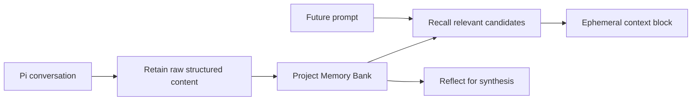

import { Card, CardGrid } from "@astrojs/starlight/components";

Pi Hindsight recalls relevant project memory before model calls, retains structured session deltas after agent runs, and exposes explicit memory tools when you want direct control.

<CardGrid>
  <Card title="Start" icon="rocket">
    Install the extension, connect Hindsight, choose a memory profile, and verify the first run.
    [Begin setup →](/pi-hindsight/start/getting-started/)
  </Card>
  <Card title="Concepts" icon="open-book">
    Understand Memory Banks, Retain, Recall, Reflect, queue durability, imports, and safety rules.
    [Learn the model →](/pi-hindsight/concepts/)
  </Card>
  <Card title="Guides" icon="setting">
    Follow task workflows for profiles, setup/status checks, imports, recall inspection, queue
    recovery, and smoke tests. [Pick a workflow →](/pi-hindsight/guides/)
  </Card>
  <Card title="Reference" icon="document">
    Look up exact config fields, tools, commands, hooks, import controls, and generated surface
    details. [Open reference →](/pi-hindsight/reference/)
  </Card>
</CardGrid>

## Memory path

## Safety defaults

- Project memory stays in a project bank by default.
- Global/user memory is opt-in and explicitly configured.
- Recall injection is ephemeral; recalled memory is not written back into transcripts.
- Retain uses stable document IDs and queue durability.
- Automatic retain redacts common secrets before writing memory.

## Where to go next

<CardGrid>
  <Card title="Five-minute setup" icon="right-arrow">
    Use the shortest successful path from install to verified memory. [Getting
    started](/pi-hindsight/start/getting-started/)
  </Card>
  <Card title="Choose memory scope" icon="laptop">
    Compare project-only, project+global, and global-only modes. [Memory
    profiles](/pi-hindsight/start/memory-profiles/)
  </Card>
  <Card title="Import old sessions" icon="download">
    Preview and import Pi session JSONL history with deterministic document IDs. [Importing
    sessions](/pi-hindsight/guides/importing-sessions/)
  </Card>
  <Card title="Troubleshoot memory" icon="information">
    Inspect status, recalls, receipts, queue state, and smoke-test output. [Status and setup
    guide](/pi-hindsight/guides/use-hindsight-status/)
  </Card>
</CardGrid>
