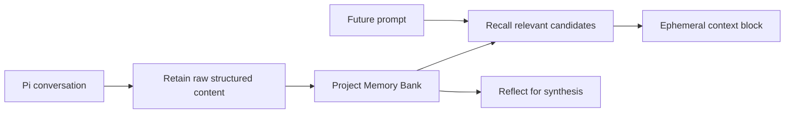

import { Card, CardGrid } from "@astrojs/starlight/components";

Pi Hindsight gives Pi long-term memory through Hindsight. The normal workflow is:

1. install the package,
2. run `/hindsight`,
3. choose a memory profile,
4. let automatic Recall/Retain handle future sessions,
5. optionally import old sessions.

<CardGrid>
  <Card title="Start here" icon="rocket">
    Install the extension, connect Hindsight, choose a profile, and verify status. [Begin setup
    →](/pi-hindsight/start/getting-started/)
  </Card>
  <Card title="Use the TUI" icon="setting">
    `/hindsight` is the main surface for setup, status, profile changes, queue flushes, imports, and
    links back to these docs. [Open TUI guide →](/pi-hindsight/start/setup-tui/)
  </Card>
  <Card title="Understand the model" icon="open-book">
    Concepts explain bank boundaries, Retain, Recall, Reflect, imports, queue durability, and
    safety. [Read concepts →](/pi-hindsight/concepts/)
  </Card>
  <Card title="Look up exact names" icon="document">
    Reference pages list config fields, tools, commands, hooks, import controls, and generated
    surface details. [Open reference →](/pi-hindsight/reference/)
  </Card>
</CardGrid>

## Memory path

## Safety defaults

- Project memory stays in a Project Bank by default.
- User memory is opt-in and configured intentionally.
- Recall injection is ephemeral; recalled memory is not written back into transcripts.
- Retain uses stable document IDs and queue durability.
- Automatic retain redacts common secrets before writing memory.

## Task shortcuts

<CardGrid>
  <Card title="Choose memory scope" icon="laptop">
    Compare Project + User, Project Only, User Only, and Recall Only profiles. [Memory
    profiles](/pi-hindsight/start/memory-profiles/)
  </Card>
  <Card title="Import old sessions" icon="download">
    Preview first, then import Pi sessions or chat transcripts only when backfill is useful. [Import
    guide](/pi-hindsight/guides/importing-sessions/)
  </Card>
  <Card title="Inspect memory" icon="magnifier">
    Check last recall, retain receipts, queue state, and status diagnostics. [Inspection
    guide](/pi-hindsight/guides/inspect-recalls-and-receipts/)
  </Card>
  <Card title="Contribute" icon="puzzle">
    Verify docs, understand generated references, and follow issue/PR workflow. [Development
    docs](/pi-hindsight/development/)
  </Card>
</CardGrid>
