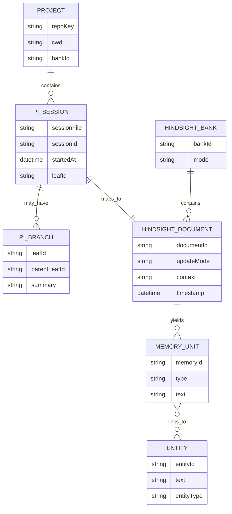
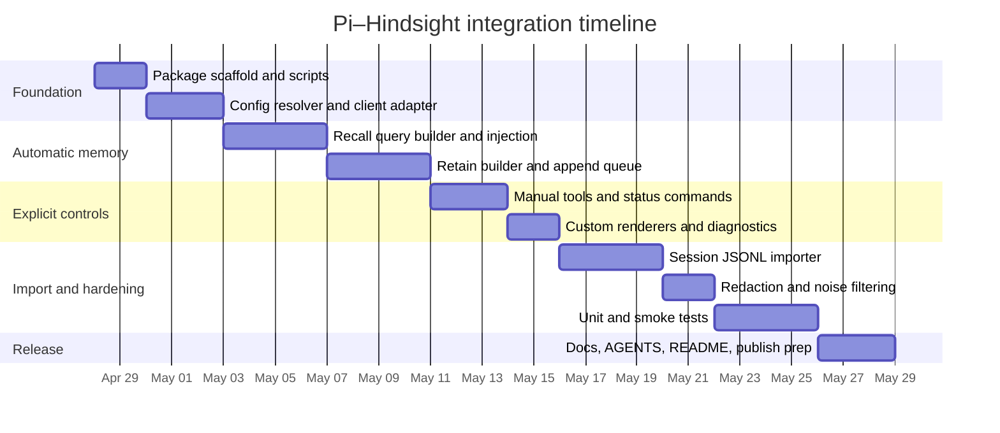

## Overview

Build a Pi extension package that integrates Hindsight as long-term memory for coding sessions.

The extension should:

- recall relevant memory before response generation
- retain structured session deltas after each completed prompt
- expose explicit Hindsight tools for recall, retain, and reflect
- support project-scoped memory with an optional shared/global bank
- support import of existing Pi session JSONL files
- remain inspectable, testable, and safe to evolve into more Pi extensions later

## Goals

- Ship a stable MVP for Pi ↔ Hindsight memory integration
- Follow official Hindsight best practices:
  - retain raw rich content
  - always set `context`
  - use stable `document_id`
  - use `update_mode: "append"` for live sessions
  - use `tags` for visibility/scope
- Follow Pi extension/package conventions so the codebase can become a reusable package
- Keep automatic memory flow simple and deterministic
- Keep explicit tools available for user-controlled workflows
- Make migration/import a first-class feature

## Non-goals

- Reimplement Hindsight retrieval or reflection logic in the extension
- Build a multi-host or multi-tenant orchestration layer in v1
- Store recalled memory blocks back into Pi transcript history
- Depend on undocumented Pi internals
- Build a generic “all memory systems” abstraction

## Assumptions

- Exact Pi SDK version is unspecified; target the current extension APIs documented in `pi-mono` as of April 2026
- Exact Hindsight deployment mode is unspecified; support both self-hosted and cloud through the official TypeScript client
- Exact Hindsight bank missions/disposition are project-defined and supplied via config defaults
- The package will initially be npm-based and locally testable with `pi -e` and `pi install`

## Architecture

### Component map

1. **Config resolver**
   - Loads package defaults
   - Applies global config
   - Applies project-local config
   - Applies environment overrides
   - Produces one resolved runtime config object

2. **Session mapper**
   - Derives project/session identity
   - Builds stable `document_id`
   - Builds tag sets
   - Tracks parent/fork lineage for import and retain provenance

3. **Hindsight client adapter**
   - Wraps `@vectorize-io/hindsight-client`
   - Adds retries, timeouts, and typed request helpers
   - Provides bank ensure/get/update helpers

4. **Recall engine**
   - Composes recall query from current prompt + optional recent turns
   - Calls one or two banks (project, optional global)
   - Merges, formats, and injects ephemeral memory block

5. **Retain engine**
   - Builds structured JSON transcript delta
   - Sanitizes secrets and optionally drops low-signal tool noise
   - Enqueues durable write job
   - Flushes queue in background or on command

6. **Tool surface**
   - `hindsight_recall`
   - `hindsight_retain`
   - `hindsight_reflect`
   - optional admin/status commands

7. **Importer**
   - Reads Pi JSONL session files
   - Walks branch lineage
   - Converts messages to Hindsight retain payloads
   - Replays historical sessions deterministically

## Entity relationship model



## Event flow mapping

| Pi hook / surface            | Trigger                            | Extension action                                                            | Hindsight operation         | Notes                                    |
| ---------------------------- | ---------------------------------- | --------------------------------------------------------------------------- | --------------------------- | ---------------------------------------- |
| `session_start`              | startup, reload, new, resume, fork | load config, restore state, preflight client, ensure bank config if enabled | optional bank create/update | do not recall here; no user query yet    |
| `context`                    | before each LLM call               | compose recall query, fetch memories, inject ephemeral memory block         | `recall`                    | preferred default injection point        |
| `before_provider_request`    | final provider payload built       | inspect/verify final injection placement                                    | none                        | debug hook; not primary business logic   |
| `agent_end`                  | one full prompt completed          | build retain delta, sanitize, enqueue jobs                                  | `retain`                    | preferred auto-retain point              |
| `session_shutdown`           | runtime tear-down                  | flush queue best-effort, persist transient state                            | none / queued retain replay | never lose acknowledged jobs             |
| tool: `hindsight_recall`     | explicit agent tool call           | run direct memory lookup                                                    | `recall`                    | returns structured result                |
| tool: `hindsight_retain`     | explicit agent tool call           | store a specific fact/decision                                              | `retain`                    | supports explicit tags/context           |
| tool: `hindsight_reflect`    | explicit agent tool call           | server-side memory synthesis                                                | `reflect`                   | use for analysis, not baseline auto-flow |
| command: `/hindsight:import` | user command                       | import selected session(s)                                                  | `retain`                    | uses `replace` for deterministic replays |

## Recommended hook strategy

### Automatic recall

Use `context` as the primary injection point.

Why:

- it is Pi’s native “modify messages before LLM call” hook
- it supports ephemeral injection
- it avoids mutating saved transcript history
- it is easier to test than provider-specific prompt rewriting

### Automatic retain

Use `agent_end` as the default auto-retain point.

Why:

- it maps to “after the prompt completed”
- it avoids write/read races in the same turn
- it cleanly captures user message + assistant answer + meaningful tool results

### Diagnostics

Use `before_provider_request` only to inspect final payload shape and prompt-cache behavior.

## Data contracts

### Resolved config

```ts
export interface ResolvedConfig {
  enabled: boolean;

  hindsight: {
    baseUrl: string;
    apiKey?: string;
    timeoutMs: number;
  };

  banks: {
    project: {
      enabled: boolean;
      bankId?: string;
      derive: "repo" | "cwd" | "manual";
    };
    global: {
      enabled: boolean;
      bankId?: string;
    };
  };

  recall: {
    enabled: boolean;
    budget: "low" | "mid" | "high";
    maxTokens: number;
    types: Array<"world" | "experience" | "observation">;
    contextTurns: number;
    injectionMode: "context";
    includeFactsInDebug: boolean;
  };

  retain: {
    enabled: boolean;
    async: boolean;
    updateMode: "append" | "replace";
    content: {
      user: string[];
      assistant: string[];
      toolResult: string[];
    };
    redactSecrets: boolean;
    queuePath: string;
  };

  import: {
    includeBranches: "current-only" | "all-leaves";
    includeCompactionSummaries: boolean;
    includeBranchSummaries: boolean;
    replaceExistingImportedDocs: boolean;
  };
}
```

### Recall block

```ts
export interface RecallBlock {
  bankId: string;
  query: string;
  rendered: string;
  memoryCount: number;
  results: Array<{
    id: string;
    text: string;
    type: "world" | "experience" | "observation";
    tags?: string[];
    metadata?: Record<string, string>;
    occurred_start?: string | null;
  }>;
}
```

### Retain job

```ts
export interface RetainJob {
  id: string;
  bankId: string;
  createdAt: string;
  documentId: string;
  updateMode: "append" | "replace";
  item: {
    content: string;
    context: string;
    timestamp?: string;
    tags?: string[];
    metadata?: Record<string, string>;
  };
  retries: number;
}
```

## Retain payload format

### Preferred live-session format

```json
[
  {
    "role": "user",
    "timestamp": "2026-04-25T10:00:00.000Z",
    "content": "Please refactor the settings loader."
  },
  {
    "role": "assistant",
    "timestamp": "2026-04-25T10:00:06.000Z",
    "content": "I will inspect config precedence and propose a minimal patch."
  },
  {
    "role": "toolResult",
    "timestamp": "2026-04-25T10:00:07.000Z",
    "toolName": "read",
    "content": "src/config.ts ..."
  }
]
```

### Required per-item fields

- `context`: descriptive source label, for example:
  - `Pi coding session for repo "acme-api", leaf abc123`
- `document_id`: stable per session, for example:
  - `pi-session:<session-uuid>`
- `timestamp`: session start timestamp for live append stream
- `tags`:
  - `source:pi`
  - `repo:<repo-key>`
  - `session:<session-id>`
  - optional `branch:<leaf-id>`
  - optional `scope:global`

### Metadata examples

```json
{
  "pi_session_file": "/home/user/.pi/agent/sessions/...jsonl",
  "pi_leaf_id": "abc123ef",
  "cwd": "/work/repo",
  "imported": "false"
}
```

## Design option comparison

### Payload format

| Option                  | Pros                                                                | Cons                              | Decision      |
| ----------------------- | ------------------------------------------------------------------- | --------------------------------- | ------------- |
| JSON conversation array | richest structure; best fact extraction; preserves timestamps/roles | slightly more work to build       | **Choose**    |
| Prefixed plaintext      | simpler/debuggable                                                  | weaker structure; easier to drift | fallback only |
| Pre-summarized text     | tiny payload                                                        | loses causal/temporal structure   | reject        |

### Bank strategy

| Option                              | Pros                                              | Cons                                 | Decision                         |
| ----------------------------------- | ------------------------------------------------- | ------------------------------------ | -------------------------------- |
| One bank per project/repo           | strong isolation; easy debugging                  | no automatic cross-project carryover | **Primary**                      |
| Project bank + optional global bank | good default for coding + cross-project learnings | two-bank merge logic                 | **Primary with optional global** |
| Single shared bank with tags        | fewer banks to manage                             | more routing/visibility mistakes     | later/advanced                   |
| One bank per session                | perfect isolation                                 | poor continuity; too fragmented      | reject                           |

### Injection target

| Option                                      | Pros                                  | Cons                                          | Decision          |
| ------------------------------------------- | ------------------------------------- | --------------------------------------------- | ----------------- |
| `context` hook                              | ephemeral; transcript-safe; Pi-native | exact provider serialization must be verified | **Choose**        |
| `before_agent_start` system prompt mutation | simple mental model                   | can make static prompt less cache-friendly    | opt-in experiment |
| `before_provider_request` payload rewrite   | maximal control                       | provider-specific and brittle                 | debug only        |

### Retain boundary

| Option                  | Pros                                  | Cons                                             | Decision    |
| ----------------------- | ------------------------------------- | ------------------------------------------------ | ----------- |
| `turn_end`              | fine-grained                          | multi-turn agent loops can over-fragment content | maybe later |
| `agent_end`             | matches user prompt lifecycle; simple | slightly coarser                                 | **Choose**  |
| `session_shutdown` only | few writes                            | higher data-loss risk                            | reject      |

## Repo layout

```text
pi-hindsight/
├── AGENTS.md
├── AGENTS.neutral.md
├── README.md
├── coding-plan.md
├── prd.md
├── package.json
├── tsconfig.json
├── extensions/
│   ├── index.ts
│   ├── config.ts
│   ├── banking.ts
│   ├── client.ts
│   ├── recall.ts
│   ├── retain.ts
│   ├── sanitize.ts
│   ├── session.ts
│   ├── inject.ts
│   ├── queue.ts
│   ├── tools.ts
│   ├── commands.ts
│   ├── renderers.ts
│   └── import-sessions.ts
├── docs/
│   ├── architecture.md
│   ├── config.md
│   └── import.md
├── tests/
│   ├── config.test.ts
│   ├── banking.test.ts
│   ├── sanitize.test.ts
│   ├── recall-format.test.ts
│   ├── import-session.test.ts
│   ├── queue.test.ts
│   └── smoke/
│       └── live-hindsight.test.ts
└── fixtures/
    └── sessions/
```

## Recommended file list

### Core

- `extensions/index.ts`
  - registers hooks, commands, tools, renderers
- `extensions/config.ts`
  - resolve config precedence
- `extensions/client.ts`
  - Hindsight client factory
- `extensions/banking.ts`
  - derive bank IDs, ensure bank profile
- `extensions/recall.ts`
  - compose recall query, call Hindsight, merge results
- `extensions/inject.ts`
  - create ephemeral Pi context message
- `extensions/retain.ts`
  - build transcript delta, enqueue flush jobs
- `extensions/queue.ts`
  - JSONL durable queue
- `extensions/sanitize.ts`
  - redact secrets, filter noisy tool output
- `extensions/import-sessions.ts`
  - parse JSONL, branch walking, historical replay

### UX and controls

- `extensions/tools.ts`
  - explicit Hindsight tools
- `extensions/commands.ts`
  - status/doctor/import/setup commands
- `extensions/renderers.ts`
  - custom memory notice rendering

### Tests

- `tests/import-session.test.ts`
  - verifies JSONL → retain payload mapping
- `tests/queue.test.ts`
  - verifies offline buffering and replay
- `tests/live-hindsight.test.ts`
  - verifies real Hindsight integration when configured

## Milestones



## Implementation phases

### Phase 1: package skeleton

Deliver:

- `package.json`
- `tsconfig.json`
- extension entrypoint
- config loading
- Hindsight client factory
- one `/hindsight:status` command

Exit criteria:

- extension loads in Pi
- client health check works
- config resolution is deterministic

### Phase 2: auto recall

Deliver:

- current-prompt recall query composer
- project-bank recall
- ephemeral injection renderer
- debug inspection command

Exit criteria:

- recalled facts appear in model context
- no recall block is persisted to transcript
- provider payload inspection confirms placement

### Phase 3: auto retain

Deliver:

- transcript delta builder
- sanitizer
- JSONL queue
- append-mode document writes

Exit criteria:

- conversation writes use stable `document_id`
- repeated prompt cycles append cleanly
- outage simulation stores jobs locally and replays later

### Phase 4: explicit tools and commands

Deliver:

- `hindsight_recall`
- `hindsight_retain`
- `hindsight_reflect`
- `/hindsight:doctor`
- `/hindsight:import`

Exit criteria:

- tools are visible and typed
- reflect returns structured or textual answers on demand
- doctor command catches config/connectivity failures

### Phase 5: import/migration

Deliver:

- Pi session parser
- current-branch import
- all-leaf import option
- import manifest / dedupe

Exit criteria:

- historical Pi sessions ingest once only
- reimport with `replace` produces deterministic update behavior
- branch/fork provenance is preserved in tags/metadata

## Minimal code snippets

### Extension skeleton

```ts
import type { ExtensionAPI } from "@earendil-works/pi-coding-agent";

import { registerCommands } from "./commands.js";
import { registerTools } from "./tools.js";
import { createRuntime } from "./runtime.js";

export default function hindsightExtension(pi: ExtensionAPI) {
  const runtime = createRuntime(pi);

  registerCommands(pi, runtime);
  registerTools(pi, runtime);

  pi.on("session_start", async (_event, ctx) => {
    await runtime.initialize(ctx);
  });

  pi.on("context", async (event, ctx) => {
    return runtime.injectRecall(event, ctx);
  });

  pi.on("agent_end", async (event, ctx) => {
    await runtime.enqueueRetain(event, ctx);
  });

  pi.on("session_shutdown", async () => {
    await runtime.flushBestEffort();
  });
}
```

### Hindsight retain helper

```ts
import { HindsightClient } from "@vectorize-io/hindsight-client";

export async function appendSessionDelta(args: {
  client: HindsightClient;
  bankId: string;
  documentId: string;
  context: string;
  timestamp: string;
  tags: string[];
  metadata: Record<string, string>;
  contentJson: string;
}) {
  await args.client.retain(args.bankId, args.contentJson, {
    document_id: args.documentId,
    update_mode: "append",
    context: args.context,
    timestamp: new Date(args.timestamp),
    tags: args.tags,
    metadata: args.metadata,
    async: true,
  } as any);
}
```

### Recall helper

```ts
export async function recallForPrompt(client: any, bankId: string, query: string, tags?: string[]) {
  return client.recall(bankId, query, {
    budget: "mid",
    maxTokens: 800,
    tags,
    tagsMatch: "all_strict",
    queryTimestamp: new Date().toISOString(),
  });
}
```

## Testing strategy

### Unit tests

- config precedence
- bank derivation
- stable `document_id` generation
- retain payload builder
- secret redaction
- noisy tool filtering
- queue append/replay
- importer branch walking

### Integration tests

- live `recall`
- live `retain` append
- live `reflect`
- create/get/list/update/delete document
- project bank + optional global bank merge

### Smoke scenarios

1. New repo, no bank exists
2. Existing bank, recall works on first prompt
3. Hindsight unavailable during retain, queue stores job
4. Restart Pi, queue replays
5. Import old session JSONL, memories appear
6. Forked session import preserves provenance tags

## Commands

### Development

```bash
npm install
npm run build
npm run typecheck
npm test
```

### Local load in Pi

```bash
pi -e ./extensions/index.ts
```

### Install as local package

```bash
pi install .
```

### Suggested package scripts

```json
{
  "scripts": {
    "build": "tsc -p tsconfig.json",
    "typecheck": "tsc -p tsconfig.json --noEmit",
    "test": "vitest run",
    "test:watch": "vitest",
    "smoke": "node ./tests/smoke/live-hindsight.test.js"
  }
}
```

## Migration and import strategy

### Goals

- import existing Pi session files without duplicates
- preserve enough provenance to reprocess later
- support later reingestion when missions/tagging rules change

### Source model

Pi sessions are JSONL trees. Import should:

1. read header
2. index entries by `id`
3. identify leaf or leaves
4. walk each leaf back to root
5. reverse into chronological order
6. extract relevant message objects

### Import modes

#### Current branch only

Best default.

- imports the active branch path
- simplest semantics
- avoids duplicating alternate branches by surprise

#### All leaves

Advanced mode.

- imports each leaf path as its own document
- tags each document with `branch:<leaf-id>`
- useful for longitudinal experiments

### Historical document IDs

Use:

- session import:
  - `pi-import:<session-uuid>:leaf:<leaf-id>`
- live session continuation:
  - `pi-session:<session-uuid>`

### Imported tags

- `source:pi`
- `imported:true`
- `repo:<repo-key>`
- `session:<session-id>`
- `branch:<leaf-id>`
- optional `forked:true`

### Imported metadata

- session file path
- cwd
- parent session path if present
- import timestamp
- session header timestamp

### Import content rules

Include:

- user messages
- assistant messages
- meaningful tool results
- optional compaction summaries as explicit synthetic entries

Exclude by default:

- ephemeral recall injection notices
- decorative custom messages
- low-signal operational tool spam

### Import update behavior

- finished historical import: `replace`
- live current session continuation: `append`

### Import manifest

Maintain a local manifest file, for example:

```json
{
  "imports": {
    "pi-import:abc:leaf:def": {
      "sourceFile": "/path/session.jsonl",
      "importedAt": "2026-04-25T12:00:00.000Z",
      "contentHash": "..."
    }
  }
}
```

Use this to prevent accidental duplicate imports.

## Risks and mitigations

| Risk                                           | Impact                                        | Mitigation                                                                   |
| ---------------------------------------------- | --------------------------------------------- | ---------------------------------------------------------------------------- |
| recall injected in the wrong provider position | degraded prompt caching or weak memory effect | inspect with `before_provider_request`; keep injection strategy configurable |
| over-retaining noisy tool output               | memory clutter                                | default meaningful-only tool retention + sanitizer                           |
| duplicate historical imports                   | noisy banks                                   | manifest + deterministic import IDs                                          |
| secrets retained into memory                   | severe                                        | mandatory redaction pipeline before enqueue                                  |
| cross-project leakage                          | wrong recall                                  | per-project bank default; strict tags where needed                           |
| write failures during outage                   | memory loss                                   | local JSONL queue with replay                                                |

## Open questions

- Should v1 ship with optional global-bank dual recall, or only project bank?
- Should branch summaries and compaction summaries be imported by default or opt-in?
- How aggressive should secret redaction be before false positives become annoying?
- Should `hindsight_reflect` return plain text only, or allow structured schemas in the tool contract?
- Do we want a static project bank ID by config, or deterministic repo-derived IDs by default?
